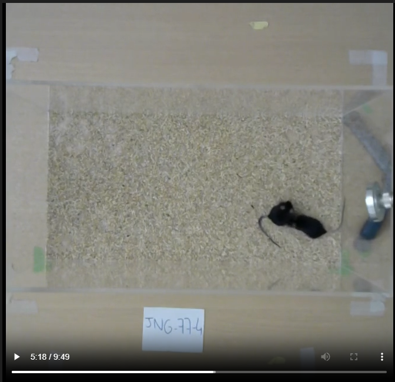

# Social interaction test automatic annotation - With [DeepEthogram](https://github.com/jbohnslav/deepethogram) and [Sleap](https://sleap.ai/develop/index.html)

- Written by Santiago Holguin 
- [holguinsanty@gmail.com](mailto:holguinsanty@gmail.com)

## 1. Clone our repository
### Clone with git :
First make sur to have [Git](https://git-scm.com/downloads) installed on your pc. Then execute on console: 

`git clone https://github.com/HOLGUINsantiago/SIT_auto_track-anotate `

### Get pretrained models :


On demand to [holguinsanty@gmail.com](mailto:holguinsanty@gmail.com) or  [marion.rivalan@cnrs.fr](mailto:marion.rivalan@cnrs.fr)

1. Copy the pretrained models on your deepEthogram project `SIT_deepethogram/models/` (if the folders exist, delete them, they are not usefull)
2. Copy the pretrained models on your sleap project `SLEAP_track\models\` (if the folders exist, delete them, they are not usefull)
3. Change all the absolute paths of this project : Use visual studio code or other tool for replacing `D:\SIT_auto` by your own `path (ex : C:\USER_X\TOOLS\SIT\SIT_auto_track-anotate)`

The pretrained models are only capable of tracking and annotating videos having this exactly setup, retraining models is manadatory if your setup is different



## 2. DeepEthogram installation - For NVIDIA GPU - CUDA 11.8
Make sure to have [cuda](https://developer.nvidia.com/cuda-11-8-0-download-archive) and [conda](https://www.anaconda.com/docs/getting-started/miniconda/install#windows-powershell) installed on your PC
1. Create environment : 
    
    `conda create --name deg_social  python=3.7`
    
2. Connect to env : 
    
     `conda activate deg_social`
    
3. Installer pyside2 : 
    
    `conda install -c conda-forge pyside2=5.15.6`
    
4. Install torch versions (for cuda 11.3 even if you have cuda 11.8) : 
    
    `pip install torch==1.10.2+cu113 torchvision==0.11.3+cu113 torchaudio==0.10.2 -f https://download.pytorch.org/whl/cu113/torch_stable.html`
    
5. Resolve issues by installing tensorboard : 
    
    `pip install tensorboard==2.11.2`
    
6. Change version of pytorch-lighting :
    
    `pip install pytorch-lightning==1.5.10`
    
7. Install it 
    
    `pip install deepethogram`
    
8. Try it !!
    
    `deepethogram`

If you use DeepEthogram within Jupyter Notebook or install any packages beyond DeepEthogram's dependencies, you may experience a loss of functionality in DeepEthogram.
We recommend creating two separate conda environments: one for Jupyter Notebook and another exclusively for DeepEthogram.

## 3. Install sleap (training and using sleap GUI)
```{bash}
conda create -y -n sleap-tracking -c conda-forge -c nvidia -c sleap/label/dev -c sleap -c anaconda sleap=1.4.1
conda activate sleap-tracking
sleap-label
```

## 4. Install sleap (automatic infering, correction GUI).
Use this conda environment for the use of correction GUI
```{bash}
conda create -y -n sleap-no-GUI -c conda-forge -c nvidia -c sleap/label/dev -c sleap -c anaconda sleap=1.4.1
conda activate sleap-no-GUI
conda install -c conda-forge pyqt
```

## Data availability
Pretrained models, and annotated videos are available on demand by contacting Dr. Marion Rivalan ([marion.rivalan@cnrs.fr](mailto:marion.rivalan@cnrs.fr)) from [NeuroPSI Sylvie Granon team](https://neuropsi.cnrs.fr/departements/cnn/equipe-sylvie-granon/)

# Context situations : 

### [I want to train DeG models with Solomon data files](docs\SolomonTransformation.md)

Go to [this readme]((docs\SolomonTransformation.md))

### [I want to re-train sleap models](https://sleap.ai/develop/tutorials/initial-training.html)

Use :

`conda activate sleap-tracking`

`sleap/label`

And then follow sleap [documantation](https://sleap.ai/develop/tutorials/initial-training.html)


### [I want to crop videos](crop_rotate.py)

This script:

- Skips initial minutes (`skip_minutes`).
- Rotates if needed (`rotate`, `rotate_angle`).
- Crops if needed (`crop=(w, h, x, y)`).
- Converts videos to `.mp4` for tracking.

**Usage example:**

```python
preprocess_videos(
    input_folder="path/to/raw_videos",
    output_folder="for_tracking",
    skip_minutes=19,
    rotate=False
)
```